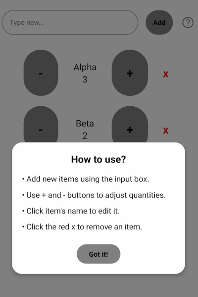

# Kountem

Kountem is a simple cross-platform mobile app built with React Native and Expo.
It's designed to help users track item quantities during group orders (e.g., when ordering food with friends) through a clean interface for adding items and adjusting counts.

Add items, increase or decrease counts in a clean and simple interface.

> Currently, only the Android APK build is available in the Releases page.

## Screenshot



## Get started

1. Install dependencies

   ```bash
   npm install
   ```

2. Start the app

   ```bash
    npx expo start
   ```

## Build from eas
   This command will require expo login

    npm install -g eas-cli
   
   build... (choose one)
    
    eas build -p android --profile development
    eas build -p android --profile preview
    eas build -p android --profile production

   Refer https://docs.expo.dev/build-reference/apk/